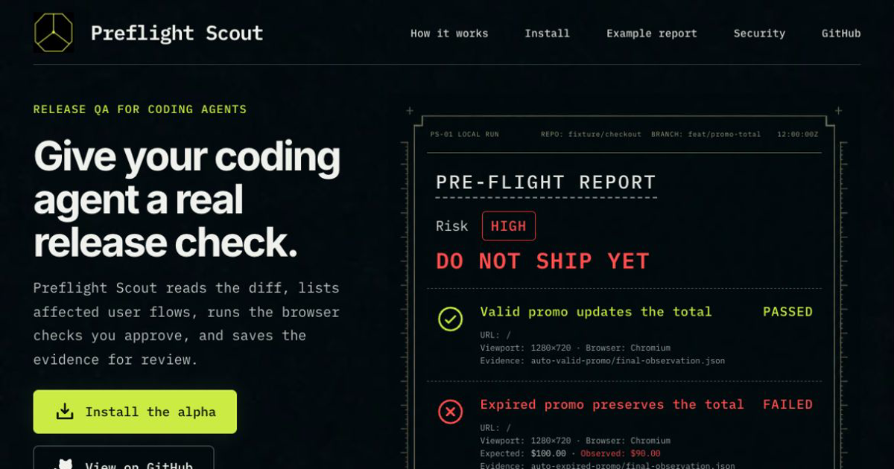

# Preflight Scout — Release QA for coding agents

<a href="https://preflightscout.com">
  
</a>

<p align="center">
  <a href="https://github.com/fenutech/preflight-scout/actions/workflows/ci.yml"></a>
  <a href="https://www.npmjs.com/package/@preflight-scout/cli"></a>
  <a href="https://github.com/fenutech/preflight-scout/releases/latest"></a>
  <a href="package.json"></a>
  <a href="LICENSE"></a>
</p>

<p align="center">
  <a href="https://preflightscout.com">Website</a> ·
  <a href="https://preflightscout.com/install/">Installation</a> ·
  <a href="https://preflightscout.com/example-report/">Example report</a> ·
  <a href="https://preflightscout.com/security/">Security</a>
</p>

Preflight Scout turns a pull-request diff into focused manual checks and
reviewed browser missions. It writes reports and evidence locally so you can
inspect the result before shipping.

> [!IMPORTANT]
> Preflight Scout is public alpha software. Use test accounts on local, preview,
> or staging targets. Review each browser mission before it runs and inspect the
> results before shipping.

Built and maintained by [Andrea Fenu](https://github.com/anfen93) at
[Fenutech](https://fenutech.com).

**See the output:** [illustrative sample report](examples/sample-report/report.md), its
[full HTML view](examples/sample-report/report.html), and its
[fixture disclosure](examples/sample-report/README.md) for the evidence shape.

## What it gives you

- affected routes, APIs, roles, and product flows
- risk-ranked manual checks and browser missions
- authenticated Playwright session bootstrap
- screenshots, traces, console and network failures, and final observations
- a Markdown, HTML, JSON, and optional PDF release report
- optional promotion of a useful mission into a reviewed Playwright regression test

Preflight Scout uses an LLM to map the diff plus a bounded repository inventory
of Git-visible paths, selected root project files, and package-manager evidence
to affected product areas. Deterministic code handles secrets, browser limits,
evidence, and report output. Without an LLM provider, it can run diagnostics
and work with existing artifacts, but it cannot create the impact map.

## Install it for your agent

A complete local installation has two parts:

1. The CLI analyzes repositories, runs the browser, and writes evidence.
2. The Agent Skill teaches Codex or Claude Code how to operate that CLI safely.

Installing only the skill leaves the agent in checklist-only mode. Installing
only the CLI leaves the human to drive the commands manually.

### 1. Install the CLI

Requirements: Node.js 22.13 or newer. For users and agents, the recommended
release installation uses npm and does not require pnpm. This repository may be
available before its packages are published, so first confirm that the official
`v0.1.6` release and the live npm registry both list
`@preflight-scout/cli@0.1.6`. If either is missing, do not run the registry
install.

After both checks pass, install the exact version and its matching browser:

```bash
npm view @preflight-scout/cli@0.1.6 version --registry=https://registry.npmjs.org/
npm install --global @preflight-scout/cli@0.1.6 --registry=https://registry.npmjs.org/
preflight-scout install-browser
preflight-scout --version
```

Keep the version pin. Do not replace it with `latest` in agent instructions or
reproducible setup notes. Installing Chromium is a separate, explicit step so
the npm package does not download a browser during `postinstall`.

After the same release and registry checks, this is useful for a quick trial:

```bash
npm exec --yes --registry=https://registry.npmjs.org/ --package=@preflight-scout/cli@0.1.6 -- preflight-scout --help
```

`npm exec` uses an ephemeral cached environment. It is not a durable agent
installation; use the global command for normal local QA.

#### Source installation for contributors and unreleased builds

Until the exact release exists—or when developing Preflight Scout itself—use a
stable source checkout. Requirements are Node.js 22.13 or newer and pnpm 11.12
or newer. Clone once, or reuse an existing trusted canonical checkout that can
remain at a stable path:

```bash
git clone https://github.com/fenutech/preflight-scout.git
cd preflight-scout
corepack enable
pnpm install --frozen-lockfile
pnpm install:source-cli
preflight-scout --version
```

`install:source-cli` builds the workspace, verifies the CLI distribution,
installs its matching Chromium, and validates the installed command. It writes
`preflight-scout` to `~/.local/bin` (or `XDG_BIN_HOME`) with the absolute paths of the
current Node executable and this checkout's built CLI. The command therefore
works in fresh shells and agent tasks, but moving or deleting either target
breaks it. To select another executable directory:

```bash
pnpm install:source-cli -- --bin-dir /absolute/path/to/bin
```

The installer refuses to replace an unrelated command. `--force` preserves the
old command as a timestamped backup before replacing it. If the chosen directory
is not on `PATH`, the installer prints the absolute command; update shell
configuration only with the user's permission.

After pulling or otherwise updating the source checkout, rerun
`pnpm install --frozen-lockfile` and `pnpm install:source-cli` so the pinned
command, build verification, and Chromium installation match that checkout.

Pair an unreleased source CLI only with the skill folder from that same checkout.
Use the [direct Codex or Claude Code installation](docs/skills.md#direct-codex-installation)
and invoke the short `$preflight-scout` or `/preflight-scout` name. Do not mix an
unreleased source CLI with the `plugin-stable` marketplace channel; that branch
intentionally remains on the previous published version. If you prefer the
marketplace install, wait for the matching GitHub and npm release.

The package name and version in this repository describe the intended release;
they are not evidence that the package is live in the registry.

### 2. Install the Agent Skill

The marketplace commands below are for the released npm CLI. If you used the
source fallback above, install the skill directly from the same checkout
instead.

Codex:

```bash
codex plugin marketplace add fenutech/preflight-scout --ref plugin-stable
codex plugin add preflight-scout@preflight-scout
```

Alternatively, after adding the marketplace, open `/plugins`, select
`preflight-scout`, and install **Preflight Scout** there.

Claude Code:

```bash
claude plugin marketplace add fenutech/preflight-scout@plugin-stable
claude plugin install preflight-scout@preflight-scout
```

Invoke `$preflight-scout:preflight-scout` in Codex. In Claude Code, the plugin
command is `/preflight-scout:preflight-scout`. A directly copied skill uses
`$preflight-scout` in Codex or `/preflight-scout` in Claude Code.

After installing the plugin, restart the client and start a new task or session
in the repository to test. Then use one of these exact prompts:

```text
Use $preflight-scout:preflight-scout to verify the current change against origin/main. Start with setup diagnostics, let me review the mission before browser execution, do not run dangerous actions, and finish with release readiness plus evidence paths.
```

```text
Use /preflight-scout:preflight-scout to verify the current change against origin/main. Start with setup diagnostics, let me review the mission before browser execution, do not run dangerous actions, and finish with release readiness plus evidence paths.
```

These commands install from the `plugin-stable` branch. That branch advances
only after the same release has been published to npm, installed successfully
on Linux and Windows, and recorded as the latest GitHub release. Adding it to a
client does not create an external marketplace listing or install the separate
CLI.
Direct skill-folder and web-upload fallbacks are documented in
[docs/skills.md](docs/skills.md).

### Keep the CLI and skill current

Preflight Scout does not replace its own executable. Check the official npm
release and print the exact update commands with:

```bash
preflight-scout update-check --skill-version 0.1.6
```

The `0.1.0` CLI predates `update-check`. To upgrade from it, first confirm that
both the GitHub `v0.1.6` release and `@preflight-scout/cli@0.1.6` exist, then run
the exact npm and browser commands in [Install the CLI](#1-install-the-cli).
Refresh the plugin below, restart the client, and use `update-check` from then
on.

Update the CLI with the exact version reported by that command, then install
the matching browser build. Refresh the plugin separately:

```bash
# Codex
codex plugin marketplace upgrade preflight-scout

# Claude Code
claude plugin marketplace update preflight-scout
claude plugin update preflight-scout@preflight-scout
```

Restart Codex or Claude Code and start a new task or session after the plugin
update. For GitHub Actions, keep the full commit SHA pin and let Dependabot or
Renovate propose reviewed updates; do not switch the Action to a floating tag.

If you installed the marketplace before the stable channel existed, migrate it
once. Codex requires removing the old marketplace source, re-adding it, and
installing the plugin again. Claude Code can replace the source in place:

```bash
# Codex
codex plugin marketplace remove preflight-scout
codex plugin marketplace add fenutech/preflight-scout --ref plugin-stable
codex plugin add preflight-scout@preflight-scout

# Claude Code
claude plugin marketplace add fenutech/preflight-scout@plugin-stable
```

## Configure analysis

From the repository you want to test, choose either a provider API or an authenticated local agent.

OpenAI API:

```bash
export PREFLIGHT_SCOUT_LLM_PROVIDER=openai
export OPENAI_API_KEY=...
```

Authenticated Codex CLI, without a raw API key:

```bash
export PREFLIGHT_SCOUT_LLM_PROVIDER=codex-exec
```

PowerShell:

```powershell
$env:PREFLIGHT_SCOUT_LLM_PROVIDER = "codex-exec"
```

Use `claude-exec` in either shell when Claude Code is the signed-in agent.

Then initialize, diagnose, and analyze the current change:

```bash
preflight-scout init --target frontend --local-url http://127.0.0.1:3000 --base origin/main --target-env local

preflight-scout doctor --base origin/main --head HEAD
preflight-scout analyze --base origin/main --head HEAD --open-report
```

Run the reviewed analysis in a browser:

```bash
preflight-scout run --analysis-dir .preflight-scout/runs/latest --target frontend --env local --open-report
```

Use the included generic app when you want a self-contained first pass:

```bash
preflight-scout demo --output /tmp/preflight-scout-generic-shop --force
cd /tmp/preflight-scout-generic-shop
python3 -m http.server 4173
```

## Current model support

Defaults were verified against official provider documentation on 2026-07-13.

| Provider | Environment | Default |
| --- | --- | --- |
| OpenAI Responses API | `PREFLIGHT_SCOUT_LLM_PROVIDER=openai`, `OPENAI_API_KEY` | `gpt-5.6` |
| Anthropic Messages API | `PREFLIGHT_SCOUT_LLM_PROVIDER=anthropic`, `ANTHROPIC_API_KEY` | `claude-sonnet-5` |
| Gemini API | `PREFLIGHT_SCOUT_LLM_PROVIDER=gemini`, `GEMINI_API_KEY` | `gemini-3.5-flash` |
| OpenAI-compatible gateway | `PREFLIGHT_SCOUT_LLM_PROVIDER=openai-compatible`, key, base URL, and `PREFLIGHT_SCOUT_MODEL` | explicit gateway model required |
| Local agents | `codex-exec`, `claude-exec`, `gemini-exec` | installed agent default |

OpenAI uses `gpt-5.6` by default. Choose another supported model when you need a
different cost or speed profile. Local-agent modes use the agent's configured
default unless `PREFLIGHT_SCOUT_EXEC_MODEL` is set.

OpenAI first-party calls use the Responses API with strict JSON Schema and `store: false`. Anthropic Structured Outputs are generally available on the Claude API for Sonnet 5, and Preflight Scout uses `output_config.format`. Every provider response is size-bounded before parsing, Zod-validated, and repaired with bounded attempts. API calls default to a 120-second timeout; trusted parent-shell `PREFLIGHT_SCOUT_LLM_TIMEOUT_MS` may set 1,000 through 600,000 milliseconds.

OpenAI-compatible gateways retain Chat Completions JSON mode and require an explicit `PREFLIGHT_SCOUT_MODEL`; Preflight Scout never assumes that a gateway accepts an OpenAI model slug.

Default `codex-exec`, `claude-exec`, and `gemini-exec` planning is a bounded,
no-tool structured-output subprocess in a temporary directory outside the
target repository, with a provider-specific minimal environment. Setting
`PREFLIGHT_SCOUT_EXEC_COMMAND` or `PREFLIGHT_SCOUT_EXEC_ARGS` is an explicit trusted-command
escape hatch. `agent-run`, delegated auth, MCP servers, and custom commands are
also trusted execution paths with their own browser, filesystem, and network
capabilities; they are not equivalent to isolated built-in planning.

## Authenticated checks

Credential values stay in environment variables. `.preflight-scout/config.yml` names them without storing the secrets:

```yaml
app:
  targets:
    frontend:
      localUrl: http://127.0.0.1:3000
      stagingUrl: https://staging.example.com
defaults:
  target: frontend
  missionLimit: 2
auth:
  loginUrl: /login
  roles:
    qa_user:
      usernameEnv: PREFLIGHT_SCOUT_BROWSER_QA_USER_EMAIL
      passwordEnv: PREFLIGHT_SCOUT_BROWSER_QA_USER_PASSWORD
      signedInTarget: testid=user-menu
```

Browser-fill credentials must use the dedicated uppercase namespace
`PREFLIGHT_SCOUT_BROWSER_<LABEL>_(EMAIL|USERNAME|PASSWORD)`. Provider or
infrastructure names such as `OPENAI_API_KEY` or `PREFLIGHT_SCOUT_DATABASE_PASSWORD`
are rejected even if a repository contract maps them. Each mission receives
only the exact credentials for its selected configured role.
Each role must also declare `signedInTarget`, an exact reviewed locator that is
visible only after login. Auth state is saved only after the generated login
mission reaches that deterministic assertion; a missing marker fails closed.

Every reviewed mission step uses an exact `policyLabel` such as `navigate`,
`fill`, or a contract-specific action. The live browser decision must repeat
that label and the reviewed step ID exactly; instructions are never used to
infer a broader capability.

Create and reuse a validated Playwright session:

```bash
preflight-scout auth login --target frontend --role qa_user --env staging
preflight-scout run --analysis-dir .preflight-scout/runs/latest --target frontend --env staging --open-report
```

Or let a tool-enabled agent own the login and browser pass:

```bash
preflight-scout auth login --agent codex --target frontend --role qa_user --env staging
preflight-scout agent-run --analysis-dir .preflight-scout/runs/latest --agent codex --env staging
preflight-scout agent-run --analysis-dir .preflight-scout/runs/latest --agent claude --env staging
```

Storage-state files may contain live cookies and tokens. Keep `.preflight-scout/auth/` out of git and do not upload authenticated evidence without reviewing it.

The default repository-local `.env.preflight-scout.local` must be both ignored and
untracked. It may hold provider keys and dedicated browser credentials, but it
cannot set privileged provider selection, model, base-ref/base-URL, execution,
proxy/TLS, Node/runtime, Git, or agent-configuration controls. To trust those
controls intentionally, set `PREFLIGHT_SCOUT_TRUST_ENV_FILE_CONTROLS=1` in the parent
environment; the flag itself is forbidden inside the file, and existing parent
values always win.

Every owned or delegated execution path accepts only a bounded absolute HTTP(S)
starting app URL without embedded credentials. Preflight Scout's built-in
Playwright missions then remain on that exact origin. They fail closed on `file:`, `data:`, browser-
internal or other non-HTTP(S) navigation, embedded URL credentials, off-origin
clicks/forms/redirects, and popups. Unsafe screenshots, traces, final
observations, and saved auth state are discarded or marked invalid. Cross-origin
SSO requires manual review. A delegated agent uses its own browser tooling and
is outside this deterministic same-origin boundary.

## Execution controls

Preflight Scout normally runs the top LLM-ranked automation candidates. You can narrow or expand execution explicitly:

```bash
preflight-scout run --mission-limit 1
preflight-scout run --mission-id <mission-id>
preflight-scout run --all-candidates
preflight-scout replay --mission .preflight-scout/runs/latest/mission.json --env local
```

Dangerous actions remain gated:

```bash
preflight-scout approve --action submit_payment --reason "Stripe test mode confirmed"
```

Approval decisions are stored in `.preflight-scout/approvals.local.yml`. Preflight Scout
accepts that file only when Git proves it is ignored and untracked; committed
or legacy `.preflight-scout/approvals.yml` decisions are refused.

Promote a successful, reviewed run into a test only when you want to modify the target repository:

```bash
preflight-scout promote \
  --run-dir .preflight-scout/runs/latest \
  --output-dir tests/preflight-scout
```

## Evidence

Analysis and execution write durable artifacts under `.preflight-scout/runs/latest/`:

- `analysis-manifest.json`, which binds the reviewed inputs and declares the
  current artifact and evidence digests
- `impact-map.json`
- `mission.json`
- `report.md`, `report.html`, `report-summary.json`, and optional `report.pdf`
- `run-result.json` or `run-results.json`
- per-step screenshots and `final-observation.json`
- `trace.zip`, `console-errors.json`, and `network-errors.json`

Reports separate executed evidence from planned checks, failures, blockers, and unknowns. A blocked mission is not reported as a pass.

`run --analysis-dir` and `agent-run --analysis-dir` accept only an analysis for
the same repository, indexed context, exact base and head commits, contract,
schema, Preflight Scout version, and exact Preflight Scout package-code/build
identity for the analysis entrypoint. A packaged CLI verifies its own package
metadata and declared outputs together with the core package; browser results
also record the exact Preflight Scout CLI/browser-runner package-code/build
identity that produced them. These identities do not attest third-party
dependencies, Node.js, the operating system, or the browser build. `replay --mission`
applies the same checks to the mission's analysis directory before opening a
browser. A legacy directory without a manifest, a bundle copied from a
different repository, or a modified artifact fails closed. Run
`preflight-scout analyze` again, review the new files, and retry; there is no
in-place upgrade for an old analysis directory.

The manifest also binds `report.md`, `report.html`, `report-summary.json`, and
an optional `report.pdf`. PDF publication updates the manifest last while the
generation lock is held. The GitHub Action copies only manifest-declared bytes
into a private staging directory after re-hashing them, then uploads that
staged copy rather than mutable checkout files.

Artifact generations in one output directory are serialized. If a process
exits without removing `.analysis-generation.lock`, first confirm no writer is
active, then remove only that lock file and retry.

Browser evidence is written into a unique generation directory before
publication. Result JSON stores portable paths relative to the run directory,
not absolute checkout paths. Rebuilding a report revalidates the complete
declared bundle under the generation lock. Optional PDF output is rendered to a
unique temporary path and published only if that same bundle is still current.
An explicit `--output-dir` or
artifact input outside the repository remains supported through its own
canonical trusted boundary; contract-derived output stays confined beneath
`.preflight-scout/runs/`. A repository-local explicit output must be excluded
as a directory by Git; ignoring only its current contents is not sufficient.

## GitHub Action

The Action wraps the same pipeline for PR comments, artifacts, and merge gates.
Use it externally only when an authorized release identifies a real commit;
pin that release's full commit SHA and start with one ranked browser mission.
A planned tag or package name is not an installable release. See
[docs/github-action.md](docs/github-action.md).

## Packages

Publishing these names requires verified maintainer control of the npm
`@preflight-scout` scope and all six package names. Scope ownership is a hard
release gate; if it cannot be confirmed, rename the scope in the reviewed source
before publishing registry installation instructions.
Actual publication is restricted to a reviewed protected public tag and the
environment-protected `.github/workflows/publish.yml` workflow. Pushing the tag
starts validation; a maintainer then approves the `npm-production` deployment.
Do not publish these provenance-enabled packages from a workstation.

- `@preflight-scout/core`: repo indexing, impact mapping, mission planning, reports, and providers
- `@preflight-scout/cli`: `preflight-scout` command
- `@preflight-scout/browser-runner`: bounded Playwright evidence loop
- `@preflight-scout/github-action`: GitHub Action entrypoint
- `@preflight-scout/mcp`: MCP mission bridge
- `@preflight-scout/agent-exec`: Codex, Claude, Gemini, and custom CLI handoffs

## Development

```bash
pnpm install --frozen-lockfile
pnpm build
pnpm typecheck
pnpm test:ci
pnpm playwright:install
pnpm test:browser
pnpm check:repo
pnpm test:package-guard
pnpm test:source-cli-wrapper
pnpm pack:check
pnpm test:npm-global-smoke
pnpm smoke:npm-global
pnpm smoke:install
pnpm test:skill
pnpm package:skill
```

## License and project policy

Preflight Scout is licensed under `AGPL-3.0-only`. A separate signed commercial agreement is available for organizations that need proprietary rights in covered Preflight Scout code. Running Preflight Scout does not relicense the repository under test.

Template portions generated by Preflight Scout in normal reports and promoted-test scaffolding receive the MIT additional permission in [OUTPUT-LICENSE.md](OUTPUT-LICENSE.md). That permission does not automatically cover user, model, target-repository, screenshot, or third-party content.

External code or documentation patches require the separately executed dual-license contributor agreement described in [CONTRIBUTING.md](CONTRIBUTING.md).

## Documentation

- Start with the [Agent Skill guide](docs/skills.md), [public alpha guide](docs/public-alpha.md), or [generic demo](docs/generic-demo.md).
- Configure [providers and secret handling](docs/providers-and-security.md), [browser evidence](docs/evidence.md), or the [GitHub Action](docs/github-action.md).
- Review the [architecture](docs/architecture.md), [threat model](docs/security-threat-model.md), [security policy](SECURITY.md), and [licensing](docs/licensing.md).
- Maintainers can use the [maintainer guide](docs/maintainer-guide.md), [release checklist](docs/release-checklist.md), and [changelog](CHANGELOG.md).
