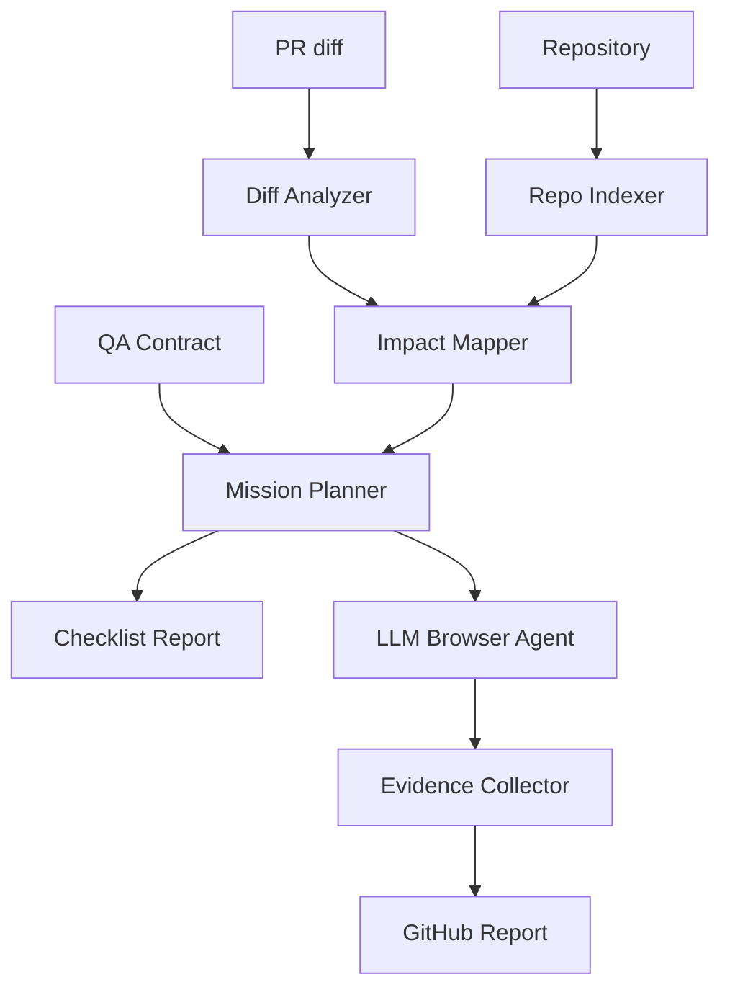

# Architecture

## Core Objects

### QA Contract

Repo-owned project context and guardrails. Generated by `preflight-scout init`, reviewed by humans.

### Repo Index

Bounded inventory of Git-visible file paths, selected root project-file
excerpts, and explicit package-manager evidence. The built-in indexer does not
currently classify frameworks, routes, components, tests, config files, or
integrations; the corresponding schema fields are reserved for enriched callers,
and an empty field means unclassified rather than absent. In a Git worktree, the
inventory is built from tracked files plus untracked, non-ignored files; Git
ignores and Preflight Scout's unconditional credential/build artifact exclusions
are applied before the file limit. The LLM-facing view uses repo-relative paths
and redacts the absolute checkout root and detected secrets.

### Impact Map

PR-specific map of changed files/symbols to affected product surfaces.

### QA Mission

Risk-ranked instructions describing what to validate and why.

### Analysis Manifest

A strict generation record written last, after the impact map, mission, and any
current browser-result set are complete. It stores digests and run-relative
evidence paths, not checkout paths or remote URLs. Reuse is bound to the
repository identity, indexed context, exact commits, contract, schema, and
exact Preflight Scout-owned package code/build for the producer entrypoint.
Packaged entrypoints verify their own package metadata and declared outputs,
together with core. Browser-result generations separately record the
Preflight Scout orchestrator and browser-runner package-code/build identity.
These values are not an attestation of third-party dependencies, Node.js, the
operating system, or the browser build. Report rebuilding checks the current
core package/schema and every manifest-declared artifact digest while
preserving the recorded producer and executor. Browser execution, replay,
delegated execution, and regression promotion additionally compare current
repository provenance; promotion also requires the recorded browser executor
to match. All consumers read only the browser results declared by the manifest.
One exclusive generation lock serializes writers to the same directory;
manifest-last publication leaves an interrupted generation non-reusable. Each
browser invocation first writes into a unique evidence generation directory.
Result paths are normalized relative to the run, and a same-directory rewrite
revalidates the complete declared bundle under the lock. Optional PDF output is
rendered separately, then committed and added to the manifest under the same
lock only if its manifest-bound HTML source bundle is still current.

### Evidence Report

The PR-facing output: tested flows, passed/failed/blocked results, screenshots/traces, and human follow-ups.
Preflight Scout writes `report.md` and `report.html` for humans, plus `report-summary.json` for automation.

## Pipeline

## Package Boundaries

- `core` must not depend on GitHub, Playwright, or MCP packages.
- `browser-runner` depends on Playwright, consumes a human-reviewed `QAMission`,
  and lets the LLM propose how to execute its steps from live observations and
  screenshots. Deterministic code permits navigation, mutation, and assertion
  only when the decision binds to the exact reviewed step, target, and policy
  label; a passing finish also requires reviewed-step coverage. The runner owns
  the same-origin HTTP(S) navigation boundary. Generic browser mechanics live
  in small action/observation modules.
- `agent-exec` delegates a mission to external coding agents such as Codex, Claude, Gemini, or custom commands. Built-in agents receive mission prompts over stdin and a kind-specific minimal environment by default; delegated browser tooling remains outside `browser-runner`'s deterministic boundary.
- `github-action` is a CI wrapper around core/browser-runner that posts PR comments, sets commit status, uploads report artifacts, and can resolve preview URLs from explicit inputs or GitHub Deployments.
- `mcp` provides generic MCP client utilities and must not assume a specific server.
- skills call the CLI and MCP tools through agent instructions.
- Reports are deterministic aggregations of LLM-created missions and browser evidence. They must not invent product impact beyond the mission/result artifacts they summarize.

## Trust Rules

- No heuristics for product reasoning. Preflight Scout may collect raw facts, but an
  LLM performs impact mapping, mission planning, config drafting, and proposals
  for executing the reviewed browser steps from live evidence.
- All LLM outputs must be structured and schema-validated with Zod. Provider adapters should use native structured output where available: OpenAI JSON Schema, Anthropic `output_config.format` JSON output, and Gemini response JSON Schema.
- Git diff ingestion retains path/status/line-count metadata for every changed
  file, but includes patch/content for at most 100 files and 512 KiB total.
  Omitted files carry explicit context-status markers. The impact-mapping user
  prompt is capped at 900 KiB, with separate repository-index and pull-request
  budgets plus `promptCoverage` markers; incomplete coverage must be reported
  as an unknown rather than treated as exhaustive.
- Never claim a pass without evidence.
- Validate the analysis manifest before reusing reviewed artifacts. Report
  rebuilding validates core package/schema compatibility and internal bundle
  consistency; executable reuse, replay, and promotion also compare current
  repository, commit, context, and contract provenance. Missing, foreign, stale, or
  partially modified bundles fail closed. The manifest is a consistency
  boundary, not a signature against an attacker who can replace the complete
  bundle and all of its digests.
- Keep browser evidence generation-specific and serialize only portable
  run-relative paths. A same-directory compare-before-replace must revalidate
  every declared child and evidence digest while holding the writer lock.
- Prefer `blocked` over guessed success.
- Do not execute dangerous actions unless the QA Contract permits them.
- Redact configured secrets from logs.
- Treat repository inventory as disclosure-sensitive input: honor Git ignore
  rules, exclude generated/auth/environment artifacts even if force-tracked, and
  send only the redacted, repo-relative index to an LLM.
- Preserve change metadata for sensitive or generated paths so risk remains
  visible, but omit those files' patch and content from LLM-facing PR context.
- Every checklist item should link back to changed files, affected routes, or explicit project context.
- Browser passes are bounded live loops. The LLM observes the page and proposes
  the next action, but deterministic enforcement rejects navigation, mutation,
  or assertion that is not bound to the exact human-reviewed mission step and
  policy labels. `finish_pass` is accepted only after the reviewed steps have
  the required execution coverage.
- Browser action failures are fed back into the LLM loop for recovery within
  the reviewed mission. Deterministic code records the failure and screenshot
  and revalidates every retry; the model cannot substitute an unreviewed target
  merely because a live action failed.
- Preflight Scout's built-in browser missions accept only an absolute HTTP(S) app URL and
  remain on its exact origin. Non-HTTP(S) or browser-internal navigation,
  embedded URL credentials, off-origin interactions and redirect hops, and
  popups fail closed. Evidence and storage state are not retained after a
  boundary violation; cross-origin SSO is manual.
- Default built-in `codex-exec`, `claude-exec`, and `gemini-exec` planning runs
  as a bounded no-tool structured-output subprocess in a temporary directory
  outside the target repository. Explicit command/argument overrides are
  trusted escape hatches.
- Agent execution passes render the same mission into a prompt and delegate to Codex/Claude/Gemini-style CLIs. Built-in CLI handoffs use stdin so full mission context is not exposed as process arguments. `agent-run`, delegated auth, MCP servers, and custom commands are trusted surfaces, not isolated planning.
- Browser credential names must use the dedicated
  `PREFLIGHT_SCOUT_BROWSER_<LABEL>_(EMAIL|USERNAME|PASSWORD)` namespace. Only the exact
  selected role is exposed to browser or delegated-agent execution.
- Authenticated browser sessions can be supplied as Playwright storage state. Storage-state files are treated as secrets and are never required for checklist mode.
